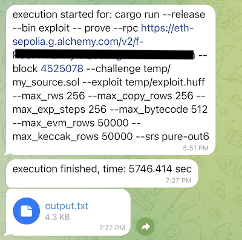

# aws informer

this dms you on telegram that a script running on your massive aws server has completed running.


## how does it work

Just add "informer" before the your command that takes lot of time to run.

```
$ informer cargo run --release
```

Once the command finishes running, the bot will send a message to your telegram.

## setup instructions

1. Install this globally

```
npm i -g aws-informer
```

2. Make sure it is in the path

```
informer --version
```

3. Setup telegram bot: https://telegram.me/BotFather and get the `TELEGRAM_BOT_TOKEN`.
4. Get your chat id, you can get it from the APIs. One easy way is: https://telegram.me/get_id_bot
5. Add your .env file

```
vim ~/.aws-informer.env

TELEGRAM_BOT_TOKEN=214554873:BAFaRuRwRyRRX-ncRSRS4q8QRBpGRnpRBRg # this is example token of your bot
TELEGRAM_CHAT_ID=834835405 # this is your chat id (unique to your telegram account)
```
6. Try `informer --test`. It should send you a test message.

## example of dms

